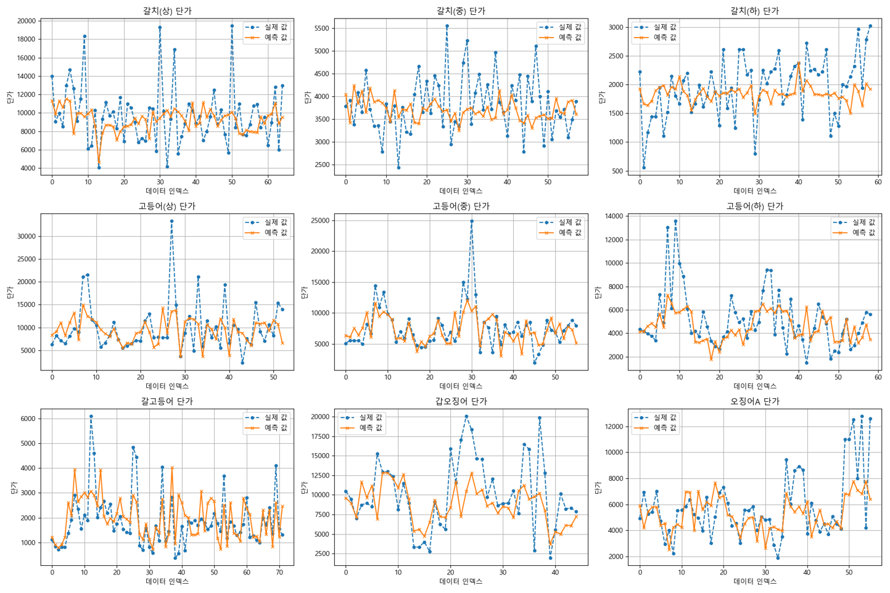
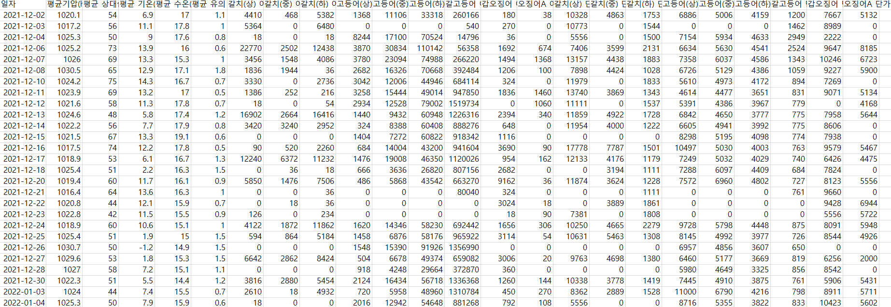
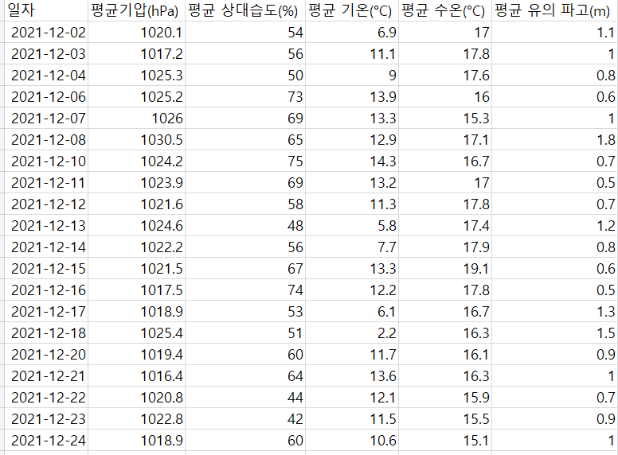
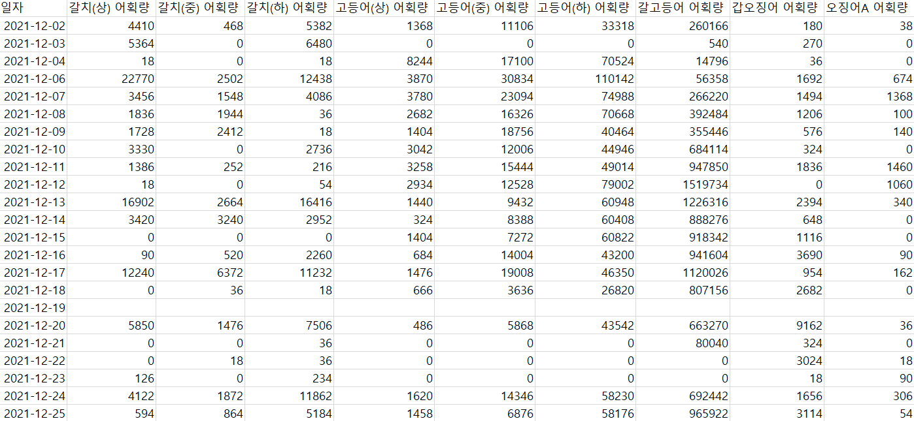
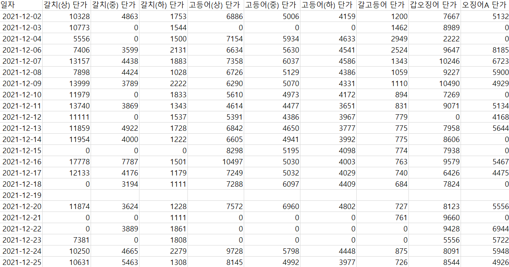

# Seafood Price Prediction

학부 딥러닝 응용 수업에서 진행한 회귀 프로젝트입니다. 날씨 정보와 품목별 어획량을 입력으로 사용해 9개 수산물 품목의 단가를 예측합니다.

## 프로젝트 정보

| 항목 | 내용 |
| --- | --- |
| 진행 시기 | 2024년 3학년 2학기 |
| 과목 | 딥러닝응용 |



## Prediction targets

- 갈치: 상·중·하
- 고등어: 상·중·하
- 갈고등어
- 갑오징어
- 오징어A

각 모델은 평균 기압, 상대습도, 기온, 수온, 유의 파고와 해당 품목의 어획량을 입력으로 사용합니다. 단가가 0 이하이거나 결측값이 있는 행은 품목별 학습·평가에서 제외합니다.

## Dataset overview

학습 데이터는 날짜별 날씨, 품목별 어획량과 단가를 결합해 구성했습니다.

### 전체 데이터 구성



### 날씨 데이터



### 어획량 데이터



### 단가 데이터



## Model presets

| preset | hidden layers | dropout | epochs | batch size |
| --- | --- | --- | ---: | ---: |
| `baseline` | 128, 64 | - | 100 | 32 |
| `tuned` | 128, 64, 32, 16 | 0.3 | 300 | 16 |

`tuned`는 수업 당시 조정한 심화 신경망 구성을 재현하는 이름이며, 자동 하이퍼파라미터 탐색을 수행한다는 뜻은 아닙니다.

## Run

```bash
python -m venv .venv
python -m pip install -r requirements.txt
python train.py --preset baseline
```

심화 구성을 실행하려면 다음과 같이 지정합니다.

```bash
python train.py --preset tuned
```

파이프라인만 빠르게 확인하려면 epoch 수를 줄이고 그래프 생성을 생략할 수 있습니다.

```bash
python train.py --preset baseline --epochs 1 --skip-plots --verbose 2
```

전체 옵션은 `python train.py --help`에서 확인할 수 있습니다.

## Outputs

기본 출력 위치는 `outputs/<preset>/`이며 다음 파일을 생성합니다.

```text
outputs/<preset>/
├─ models/                  # 품목별 Keras 모델
├─ scalers/                 # 모델별 MinMaxScaler
├─ plots/                   # 손실 및 실제값/예측값 그래프
├─ metadata.json            # 프리셋, seed, 입력 열 정보
└─ metrics.csv              # MAE, MSE, MAPE 평가 결과
```

## Repository structure

```text
seafood-price-prediction/
├─ data/                    # train.csv, test.csv
├─ docs/                    # 최종 보고서, 발표자료, 기존 결과 이미지
├─ models/                  # 수업 당시 저장한 legacy HDF5 모델
├─ train.py                 # 공통 학습·평가 CLI
└─ requirements.txt
```
